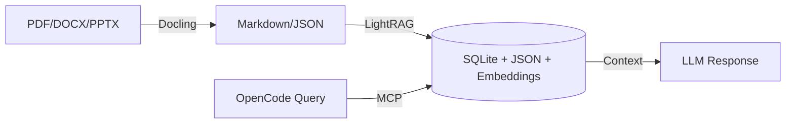

# RAG-Anything for OpenCode

A production-ready MCP server that gives OpenCode a document knowledge base with natural language querying. Index PDFs, DOCX, PPTX, images. Query across all of it with simple questions.

**Stack**: Python 3.10+ | Docling | LightRAG | OpenAI-compatible APIs

## What It Does

```
You: "What did we discuss about the API design?"
OpenCode: [searches your indexed documents]
         "Based on the architecture doc from March — the API uses 
         REST endpoints with WebSocket for real-time updates..."
```

- **Ingest**: PDF, DOCX, PPTX, images (PNG, JPEG, WebP, GIF)
- **Query**: Natural language across your entire knowledge base
- **Multimodal**: Query with inline images, tables, equations
- **Modes**: mix, hybrid, local, global, naive
- **Storage**: Local filesystem (SQLite + JSON + embeddings)

## Architecture



**Data flow**: Documents → Docling parsing → LightRAG graph + embeddings → queried via MCP → context-fed LLM responses.

## System Requirements

| Resource | Minimum | Recommended |
|----------|---------|-------------|
| **RAM** | 4GB | 8GB+ for batch processing |
| **Disk** | 2GB free | 10GB+ for model cache + storage |
| **Python** | 3.10 | 3.11-3.12 |
| **Network** | — | Stable connection for API calls |

**First run**: Docling downloads models (~1.5GB) on cold start. Large PDFs with images need more RAM.

## Quick Start

### 1. Install

```bash
python -m venv .venv
source .venv/bin/activate

pip install rag-anything-mcp
pip install docling
```

**Verify install:**
```bash
python -m rag_anything_mcp --help
```
If this errors, stop and fix before continuing.

### 2. Create Storage Directories

```bash
mkdir -p ~/rag_storage
mkdir -p ~/rag_output
```

> Treat `~/rag_storage` like a database — back it up, don't delete it between runs.

### 3. Configure OpenCode

Add to `~/.config/opencode/opencode.json`:

```json
{
  "$schema": "https://opencode.ai/config.json",
  "mcp": {
    "rag-anything": {
      "type": "local",
      "command": ["python", "-m", "rag_anything_mcp"],
      "environment": {
        "PATH": "/home/user/RAG-anything/.venv/bin:/usr/local/bin:/usr/bin:/bin",
        "OPENAI_API_KEY": "sk-...",
        "WORKING_DIR": "/home/user/rag_storage",
        "PARSER": "docling",
        "PARSE_METHOD": "auto",
        "LLM_MODEL": "kimi-k2.6",
        "EMBEDDING_MODEL": "text-embedding-3-small",
        "VISION_MODEL": "kimi-k2.6",
        "RAG_LLM_MAX_ASYNC": "4",
        "RAG_EMBED_MAX_ASYNC": "8",
        "LOG_LEVEL": "WARNING"
      },
      "enabled": true,
      "timeout": 300000
    }
  }
}
```

> **Note**: Update `PATH` to point to your actual virtual environment (e.g., `/home/yourname/projects/rag-anything/.venv/bin` or wherever you created the venv).

### Split LLM + Embeddings (Recommended with OpenCode Go)

> ⚠️ **SECURITY WARNING**: Replace with your actual API keys — never commit this file to version control. These keys grant access to paid APIs.

OpenCode's Go API provides LLM and vision but not embeddings. Use separate credentials:

```json
{
  "environment": {
    "PATH": "/home/user/RAG-anything/.venv/bin:/usr/local/bin:/usr/bin:/bin",
    "OPENAI_API_KEY": "go-your-go-key",
    "OPENAI_BASE_URL": "https://opencode.ai/zen/go/v1",
    "EMBEDDING_API_KEY": "sk-your-openai-key",
    "EMBEDDING_BASE_URL": "https://api.openai.com/v1",
    "LLM_MODEL": "kimi-k2.6",
    "EMBEDDING_MODEL": "text-embedding-3-small",
    "VISION_MODEL": "kimi-k2.6"
  }
}
```

> **Note**: Update `PATH` to your actual venv location (e.g., `/home/yourname/.venv/bin`).

`EMBEDDING_API_KEY` and `EMBEDDING_BASE_URL` default to `OPENAI_API_KEY` and `OPENAI_BASE_URL` when not set.

For running embeddings locally with Ollama (free), see [LOCAL-EMBEDDINGS.md](LOCAL-EMBEDDINGS.md).

For cloud embedding providers (Jina, Gemini, OpenAI), see [CLOUD-EMBEDDINGS.md](CLOUD-EMBEDDINGS.md).

## Query Modes Explained

| Mode | Use When | Description |
|------|----------|-------------|
| `mix` | Default choice | Auto-balances local entity search + global semantic search |
| `hybrid` | Precision needed | Local graph + vector search with re-ranking |
| `local` | Specific facts | Entity/relation search only — fast, targeted |
| `global` | Broad summaries | Full knowledge graph traversal — slower, comprehensive |
| `naive` | Debugging | Simple chunk lookup, no graph reasoning |

**Recommendation**: Start with `mix` for most queries. Use `hybrid` when precision matters. Use `local` for "who did what" questions. Use `global` for "summarize everything about X".

## Environment Variables

| Variable | Required | Default | Purpose |
|----------|----------|---------|---------|
| `OPENAI_API_KEY` | Yes | — | LLM + Vision + Embeddings (if no separate embedding key) |
| `OPENAI_BASE_URL` | No | OpenAI default | Custom endpoint for LLM/vision |
| `EMBEDDING_API_KEY` | No | `OPENAI_API_KEY` | Separate API key for embeddings |
| `EMBEDDING_BASE_URL` | No | `OPENAI_BASE_URL` | Separate endpoint for embeddings |
| `WORKING_DIR` | Yes | — | Persistent storage path (SQLite + JSON + embeddings) |
| `LLM_MODEL` | No | `kimi-k2.6` | Chat model for query generation |
| `EMBEDDING_MODEL` | No | `text-embedding-3-small` | Embedding model |
| `VISION_MODEL` | No | `kimi-k2.6` | Vision model for multimodal queries |
| `PARSER` | No | `docling` | Document parser (docling, mineru) |
| `PARSE_METHOD` | No | `auto` | Parse strategy |
| `RAG_LLM_MAX_ASYNC` | No | `4` | Concurrent LLM calls (max 8 recommended) |
| `RAG_EMBED_MAX_ASYNC` | No | `8` | Concurrent embedding calls |
| `LOG_LEVEL` | No | `WARNING` | Logging level (DEBUG, INFO, WARNING, ERROR) |

## Troubleshooting

| Symptom | Cause | Fix |
|---------|-------|-----|
| `Parser not properly installed` | Docling missing | `pip install docling` |
| `Failed to initialize LightRAG` | Invalid API key or permissions | Check `OPENAI_API_KEY` is valid |
| Timeout during ingestion | Large file + slow API | Increase `timeout` to `600000` in config |
| Empty query results | Incomplete ingestion | Verify document ingested without errors |
| Knowledge graph corruption | Killed mid-ingestion | Delete `rag_storage/` contents, re-ingest |
| Docling model download fails | Network/HF access | Set `DOCLING_CACHE_DIR` or check HuggingFace |
| OpenCode can't connect | Wrong config path | Confirm `timeout` is high enough (300s+) |
| High RAM usage | Large batch job | Lower `RAG_LLM_MAX_ASYNC`, process fewer docs at once |

## Migration & Backup

**To backup your knowledge base:**
```bash
cp -r ~/rag_storage ~/rag_storage_backup_$(date +%Y%m%d)
```

**To migrate to a new machine:**
1. Copy `~/rag_storage/` to new machine
2. Install same Python version + dependencies
3. Update `WORKING_DIR` in `opencode.json` to new path

All state is self-contained in `WORKING_DIR` — no external database needed.

## Security

**Never commit `opencode.json` or `.env` to version control.** These files contain API keys. Add to `.gitignore`:

```
.env
opencode.json
rag_storage/
rag_output/
__pycache__/
*.pyc
.venv/
```

## Development Setup

For contributing or local development:

```bash
git clone https://github.com/tbosancheros39/RAG-Anything-OpenCode.git
cd RAG-Anything-OpenCode/rag-anything-mcp

python -m venv .venv
source .venv/bin/activate

pip install -e ".[dev]"
```

**Run tests:**
```bash
pytest
```

**Lint:**
```bash
ruff check .
ruff format .
```

## Requirements Met

- [ ] Python 3.10+ installed
- [ ] `pip install rag-anything-mcp docling` succeeds
- [ ] Storage directories created
- [ ] OpenCode config updated with MCP entry
- [ ] Server starts without errors (`python -m rag_anything_mcp`)
- [ ] At least one document indexed
- [ ] Query returns relevant results
