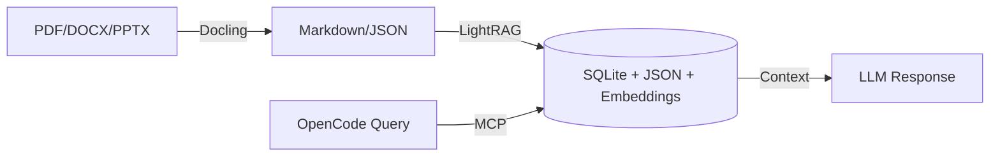

# RAG-Anything for OpenCode

I built this because I was tired of copy-pasting chunks of PDFs into chat windows. It's an MCP server that lets OpenCode actually remember your documents — index them once, query them forever.

**Stack**: Python 3.10+ | Docling | LightRAG | OpenAI-compatible APIs

## What it actually does

```
You: "What did we discuss about the API design?"
OpenCode: [searches your indexed documents]
         "Based on the architecture doc from March — the API uses 
         REST endpoints with WebSocket for real-time updates..."
```

- **Ingest**: PDF, DOCX, PPTX, Markdown, plain text, images (PNG, JPEG, WebP, GIF)
- **Query**: Natural language across your entire knowledge base
- **Multimodal**: Query with inline images, tables, equations
- **Modes**: mix, hybrid, local, global, naive
- **Storage**: Local filesystem (SQLite + JSON + embeddings)

## How it works



Documents go through Docling for parsing, then LightRAG builds a graph + embeddings. OpenCode queries via MCP and gets context-fed responses.

## What you need

| Resource | Minimum | Recommended |
|----------|---------|-------------|
| **RAM** | 4GB | 8GB+ for batch processing |
| **Disk** | 2GB free | 10GB+ for model cache + storage |
| **Python** | 3.10 | 3.11-3.12 |
| **Network** | — | Stable connection for API calls |

**Heads up**: Docling downloads ~1.5GB of models on first run. Don't panic if it sits there for a minute.

## Getting started

### 1. Install

```bash
python -m venv .venv
source .venv/bin/activate

pip install rag-anything-mcp
pip install docling
```

**Verify it actually works:**
```bash
python -m rag_anything_mcp --help
```
If this errors, stop. Fix it now. Don't hope it'll sort itself out later.

### 2. Create storage directories

```bash
mkdir -p ~/rag_storage
mkdir -p ~/rag_output
```

> `~/rag_storage` is your database. Back it up. Don't delete it between runs unless you enjoy re-indexing everything.

### 3. Configure OpenCode

Add to `~/.config/opencode/opencode.json`:

```json
{
  "$schema": "https://opencode.ai/config.json",
  "mcp": {
    "rag-anything": {
      "type": "local",
      "command": ["python", "-m", "rag_anything_mcp"],
      "environment": {
        "PATH": "/home/user/RAG-anything/.venv/bin:/usr/local/bin:/usr/bin:/bin",
        "OPENAI_API_KEY": "sk-...",
        "WORKING_DIR": "/home/user/rag_storage",
        "PARSER": "docling",
        "PARSE_METHOD": "auto",
        "LLM_MODEL": "kimi-k2.6",
        "EMBEDDING_MODEL": "text-embedding-3-small",
        "VISION_MODEL": "kimi-k2.6",
        "RAG_LLM_MAX_ASYNC": "4",
        "RAG_EMBED_MAX_ASYNC": "8",
        "LOG_LEVEL": "WARNING"
      },
      "enabled": true,
      "timeout": 300000
    }
  }
}
```

> Update `PATH` to your actual venv location. This matters — if it's wrong, docling won't be found and everything breaks silently.

### Split LLM + embeddings (recommended with OpenCode Go)

> ⚠️ **Don't commit this file.** It has your API keys in plaintext.

OpenCode's Go API handles LLM and vision but not embeddings. Route embeddings separately:

```json
{
  "environment": {
    "PATH": "/home/user/RAG-anything/.venv/bin:/usr/local/bin:/usr/bin:/bin",
    "OPENAI_API_KEY": "go-your-go-key",
    "OPENAI_BASE_URL": "https://opencode.ai/zen/go/v1",
    "EMBEDDING_API_KEY": "sk-your-openai-key",
    "EMBEDDING_BASE_URL": "https://api.openai.com/v1",
    "LLM_MODEL": "kimi-k2.6",
    "EMBEDDING_MODEL": "text-embedding-3-small",
    "VISION_MODEL": "kimi-k2.6"
  }
}
```

`EMBEDDING_API_KEY` and `EMBEDDING_BASE_URL` fall back to `OPENAI_API_KEY` and `OPENAI_BASE_URL` if you don't set them.

For free local embeddings with Ollama, see [LOCAL-EMBEDDINGS.md](LOCAL-EMBEDDINGS.md).

For cloud providers (Jina, Gemini, OpenAI), see [CLOUD-EMBEDDINGS.md](CLOUD-EMBEDDINGS.md).

## Query modes

| Mode | Use when | Description |
|------|----------|-------------|
| `mix` | Default | Balances entity search + semantic search |
| `hybrid` | Precision matters | Graph + vector with re-ranking |
| `local` | Specific facts | Entity/relation search only — fast, targeted |
| `global` | Broad summaries | Full graph traversal — slower, comprehensive |
| `naive` | Debugging | Simple chunk lookup, no graph reasoning |

Start with `mix`. Switch to `hybrid` when results feel fuzzy. Use `local` for "who did what" questions. Use `global` when you want "everything about X."

## Environment variables

| Variable | Required | Default | Purpose |
|----------|----------|---------|---------|
| `OPENAI_API_KEY` | Yes | — | LLM + Vision + Embeddings (if no separate key) |
| `OPENAI_BASE_URL` | No | OpenAI default | Custom endpoint for LLM/vision |
| `EMBEDDING_API_KEY` | No | `OPENAI_API_KEY` | Separate API key for embeddings |
| `EMBEDDING_BASE_URL` | No | `OPENAI_BASE_URL` | Separate endpoint for embeddings |
| `WORKING_DIR` | Yes | — | Storage path (SQLite + JSON + embeddings) |
| `LLM_MODEL` | No | `kimi-k2.6` | Chat model for queries |
| `EMBEDDING_MODEL` | No | `text-embedding-3-small` | Embedding model |
| `VISION_MODEL` | No | `kimi-k2.6` | Vision model for multimodal queries |
| `PARSER` | No | `docling` | Document parser (docling, mineru) |
| `PARSE_METHOD` | No | `auto` | Parse strategy |
| `RAG_LLM_MAX_ASYNC` | No | `4` | Concurrent LLM calls (max 8 recommended) |
| `RAG_EMBED_MAX_ASYNC` | No | `8` | Concurrent embedding calls |
| `LOG_LEVEL` | No | `WARNING` | Logging level |

## When things break

| Symptom | Cause | Fix |
|---------|-------|-----|
| `Parser not properly installed` | Docling missing | `pip install docling` |
| `Failed to initialize LightRAG` | Bad API key | Check `OPENAI_API_KEY` |
| Timeout during ingestion | Large file + slow API | Bump `timeout` to `600000` |
| Empty query results | Incomplete ingestion | Check ingestion finished without errors |
| Knowledge graph corruption | Killed mid-ingestion | Nuke `rag_storage/`, re-ingest |
| Docling model download fails | Network/HF issue | Set `DOCLING_CACHE_DIR` or check HuggingFace |
| OpenCode can't connect | Wrong config | Make sure `timeout` is 300s+ |
| High RAM usage | Big batch job | Lower `RAG_LLM_MAX_ASYNC`, process fewer docs |

## Backup and migration

**Back up your knowledge base:**
```bash
cp -r ~/rag_storage ~/rag_storage_backup_$(date +%Y%m%d)
```

**Move to a new machine:**
1. Copy `~/rag_storage/` over
2. Install same Python version + dependencies
3. Update `WORKING_DIR` in `opencode.json`

All state lives in `WORKING_DIR`. No external database to worry about.

## Security

**Never commit `opencode.json` or `.env` to git.** These contain API keys. Add to `.gitignore`:

```
.env
opencode.json
rag_storage/
rag_output/
__pycache__/
*.pyc
.venv/
```

## Development

```bash
git clone https://github.com/tbosancheros39/RAG-Anything-OpenCode.git
cd RAG-Anything-OpenCode/rag-anything-mcp

python -m venv .venv
source .venv/bin/activate

pip install -e ".[dev]"
```

**Run tests:**
```bash
pytest
```

**Lint:**
```bash
ruff check .
ruff format .
```

## Checklist

- [ ] Python 3.10+ installed
- [ ] `pip install rag-anything-mcp docling` works
- [ ] Storage directories created
- [ ] OpenCode config has MCP entry
- [ ] Server starts (`python -m rag_anything_mcp`)
- [ ] At least one document indexed
- [ ] Query returns something relevant
